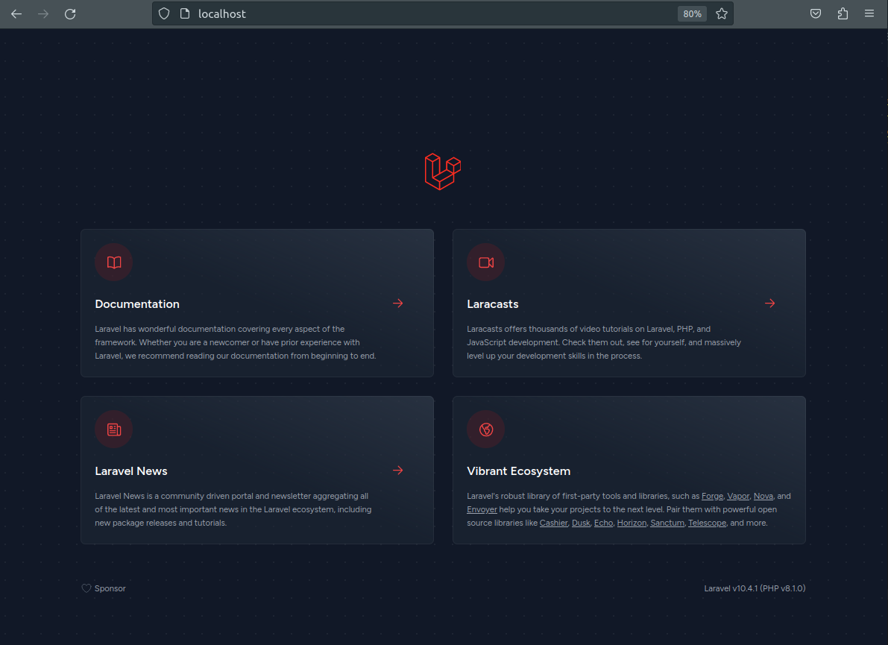

<a name="readme-top"></a>
## Description

Development Environment for Laravel


<!-- GETTING STARTED -->
## Requirements

* Docker
* Docker compose
* Git

## Getting started
* <a style="color:lightblue;" href="https://www.digitalocean.com/community/tutorials/how-to-install-and-use-docker-on-ubuntu-20-04" target="_blank">Install docker</a> 
* <a style="color:lightblue;" href="https://docs.docker.com/compose/install/linux/" target="_blank">Install docker-compose</a> 
* <a style="color:lightblue;" href="https://git-scm.com/book/en/v2/Getting-Started-Installing-Git" target="_blank">Install Git</a>
## Install laravel

1. Clone laravel base project inside "web" folder:
  ```sh
     git clone https://github.com/laravel/laravel web
  ```

2. Copy file .env.example to .env:
  ```sh
     cp web/.env.example web/.env
  ```

4. Update .env:
  ```
    DB_CONNECTION=mysql
    DB_HOST=db
    DB_PORT=3306
    DB_DATABASE=laravel
    DB_USERNAME=laravel
    DB_PASSWORD=laravel
  ```

5. Init services:
  ```sh
    docker-compose up -d 
  ```
6. Install dependencies:
  ```sh
    docker compose exec php composer install 
  ```

7. Update permissions for cache folder:
  ```sh
    sudo chmod -R 777 web/storage/
  ```

8. Create API key:
  ```sh
    docker compose exec php php artisan key:generate
  ```
9. Access to home page in the browser: http://localhost
 <br>
 <br>

 


